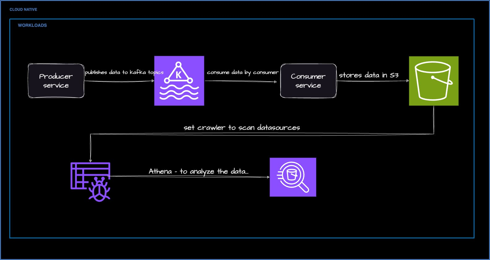
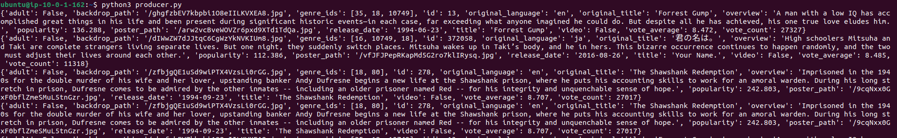
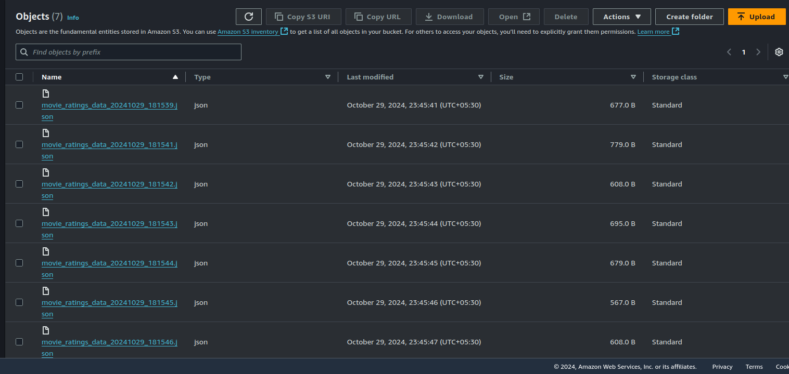
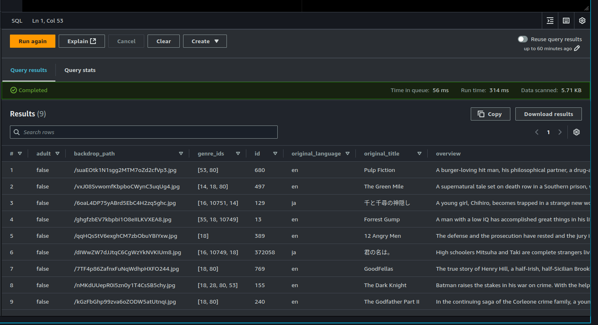

### MSK Data Pipeline 

Understanding and utilizing the MSK (Managed Streaming for Kafka) Data Pipeline, which consists of a producer that generates data, a consumer that consumes this data, and storage in S3, with Athena used for querying the data.

The MSK Data Pipeline is designed to facilitate the real-time processing of streaming data using Amazon MSK. This pipeline consists of:

    Producer: Responsible for generating and sending data (data fetching from open api such as moviedb.org api provides movie ratings and feedback) to Kafka topics.
    Consumer: Consumes the data from Kafka topics and processes it as needed.
    S3 Storage: Stores processed data for long-term retention and further analysis.
    Athena: Enables querying of the stored data in S3 using standard SQL.

This setup allows for efficient handling of real-time data streams, making it easier to analyze and derive insights from large datasets.

## setup

- clone the [code](https://github.com/krupakar0307/kafka-datapipeline-project.git) and enter to msk-terraform folder. 
- enter your required fields in vars.tf such as msk cluster name etc.
- In the vpc.tf file, currently i set to ap-south-1 region which having 2 AZ's. Change as you prefer.
- run `terraform init` and follow terraform plan and apply.
- It will create MSK cluster and bastion host. Here bastion is required to connect to kafka cluster to create topics, see the data in topics etc,. set the topic retention period etc.
- Once MSK cluster is available, then go to apps folder and copy files in bastion server and run `pip3 install requirement.txt` which will install required dependencies and then in producer.py file replace boostrap_server address,  follow `python3 producer.py` which will get the data from moviedb api and injects into kafka topic. (rename the kafka topic name) then data starts injecting to the topic.
- similalry on other tab in bastion host, execute the consumer.py with replacing your bootstrap server address and topic name along with S3 Bucket name as well.
- Here S3 bucket which will store the data informat of json files. (make sure your bastion host has iam role to write files to s3 bucket)
- Set the glue crawler for the S3 bucket that which will scan the datasource and which will help in ETL process.
- Finally use athena to view the data.

####
- once the MSK is ready, through bastion host run the requiements install and producer.py which gets the data and injects to topic in json format. 

- once consumer is executed parallely, data will be dumped to s3 bucket.

- once crawler and athena sets on datasource, the athena queried the data.

#### Kafka commands to list, create and consume data from topic.

first cd into kafka directory which is located in root path
- to list the topics
`bin/kafka-topics.sh --bootstrap-server b-1.mskdev.zos4m9.c3.kafka.ap-south-1.amazonaws.com:9092 --list` replace localhost with bootstrap server address

- to create topics
`bin/kafka-topics.sh --bootstrap-server localhost:9092 --create --topic my_topic --partitions 1 --replication-factor 1`

- to producer or insert data into topic
`bin/kafka-console-producer.sh --broker-list localhost:9092 --topic my_topic` Replace topic name to insert data into that topic.

- to consume/fetch data from topic:
`bin/kafka-console-consumer.sh --bootstrap-server localhost:9092 --topic my_topic --from-beginning`